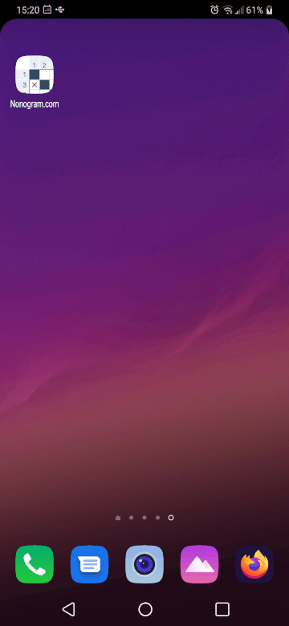

***Android only implementation.***

This project is an implementation to automatically play [nonogram from Easybrain](https://play.google.com/store/apps/details?id=com.easybrain.nonogram&gl=US):

I wanted to give this a try because it touches on algorithmics (not that complex though), computer vision (recognizing the numbers as well as the bars and playing field).

**The final result:**

